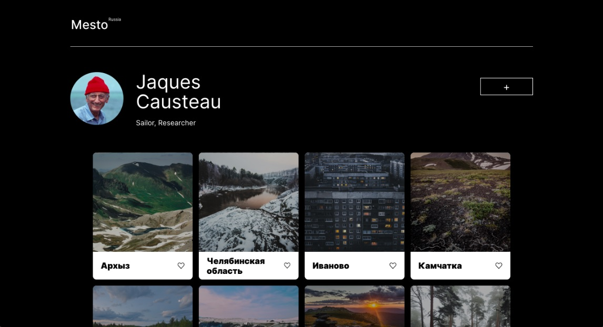

# sprint-15-deploy

Version 0.0.2

## About project:
This is a demo-project accomplished to learn the basic steps of generalized app error handling and REST API deploy to a server.

## Main functionality: 
- Mesto project allows its users to share favorite photos with their friends, like the most adorable and remove the ones that are not so heart-warming as before.
- You can have a closer look at any photo through just one click.
- Set yourself a memorable nickname and think of what words would best suit to describe who you are and what interests you have. So that other people could know you better and learn what pictures have captured your mind, as well as theirs.

## Technologies used:
ES6, OOP, CSS3, HTML5, Node.js, BEM, MongoDB

## Launch instructions:
- Open you browser and go to https://mesto-project.xyz or http://mesto-project.xyz, but https://mesto-project.xyz is much better, really. Safety, you know.
- API is stored at a subdomain: http://api.mesto-project.xyz
